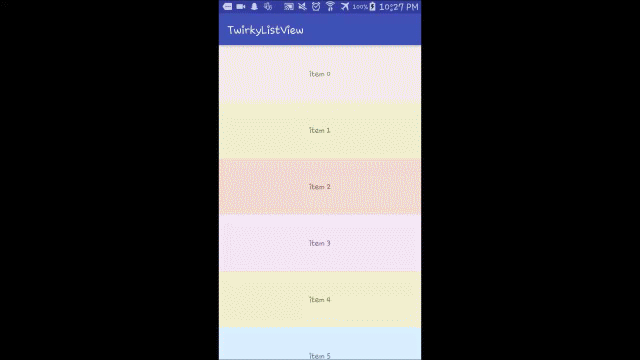

[](http://www.repostatus.org/#active)

TwerkyListView
=============
A beautiful RecyclerView which list items and animates similar to the peristaltic motion(twerking) of earthworms in Nigeria.(Inspiration
for this project wasn't completely drawn imagining or studying earthworms move neither does the author eat or rare earthworms hence any decision made by the reader to google twerking-Nigerian earthworms is at the sole discretion of the reader).
also an __*IllegalTwerkingException()*__ is thrown if Adapter does not extend __*TwerkyListView$TwerkAdapter*__

> *public-methods*

```java
      setTwerkInterpolators(Interpolator twerkpoleStart,Interpolator twerkpoleEnd) // decide twerking start and end motion interpolation
      public void setTwerking(boolean twerking)// enable/cancel twerking
      public void setTwerkingOffTime(int twerkOfftime)// reset the time it takes to complete twerk
/*
   by default
       twerkpoleStart = new FastOutSlowInInterpolator();
       twerkpoleEnd = new OvershootInterpolator();
*/

```

> *public-static-class*

```java
  class TwerkAdapter{...}
```
## Inspiration
> 'Invite me' by Stan Yakusevich @Dribble


## Appearance



## Quick Start

> Gradle

```xml
   dependencies {
        implementation 'com.github.54LiNKeR:TrumpyRecyclerView:1.trump.2'
        implementation 'com.github.54LiNKeR:TwerkyListView:1.twerk.1'
   }
```

> XML

```xml
        <linkersoft.blackpanther.twirky.TwerkyListView
            android:layout_width="match_parent"
            android:layout_height="match_parent"
            android:id="@+id/twerk"
            app:stretchScale="0.5" // expansion scale
            app:shrinkScale="0.5" // contraction scale
            app:ShrinkStretchSpan="6" // number list items to contract and expand when twerking
            app:twerkStyle="UP"/>
```

> Activity

```java
         public class MileyCyrus extends AppCompatActivity {


             @Override
             protected void onCreate(Bundle savedInstanceState) {
                 super.onCreate(savedInstanceState);
                 setContentView(R.layout.twirky);
                 Context context=this;

                 //FAKE-DATA
                 ArrayList<String> data=new ArrayList<>();
                 for (int i = 0; i < 20; i++)data.add(null);
                 //TWERKING-VIEW
                 TwerkyListView twerkList=(TwerkyListView)findViewById(R.id.twerk);
                 //LAYOUT
                 TrumpyRecycler.TrumpyLinearLayoutManager tllm= new TrumpyRecycler.TrumpyLinearLayoutManager(context);
                 tllm.setOrientation(LinearLayoutManager.VERTICAL);
                 twerkList.setLayoutManager(tllm);
                 twerkList.setFlingFactor(TrumpyRecycler.MODERATE_FLING);
                 twerkList.setFrictionFactor(TrumpyRecycler.NO_FRICTION);
                 twerkList.setOverScrollMode(TrumpyRecycler.OVER_SCROLL_NEVER);
                 //ADAPTER
                 TwerkingOffAdapter twerkdapter=new TwerkingOffAdapter(context,R.layout.twerkrow,data);
                 twerkList.setAdapter(twerkdapter);
                 //TWERKING
                 twerkList.setTwerking(true);
             }

             //TWERK-ADAPTER
             public static class TwerkingOffAdapter extends  TwerkyListView.TwerkAdapter{...}
```
 - `demo-source` [TwerkingOffAdapter](https://gist.github.com/54LiNKeR/e22021d7b8b970d1f99bc2ca0a22f669)
 

 

> *project is still under development*

[](http://play.google.com/store/apps/details?id=linkersoft.blackpanther.twirkylistview)
